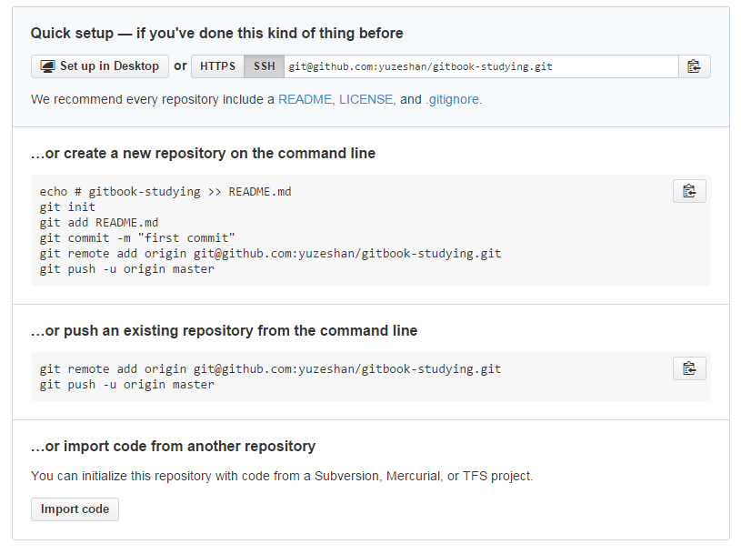
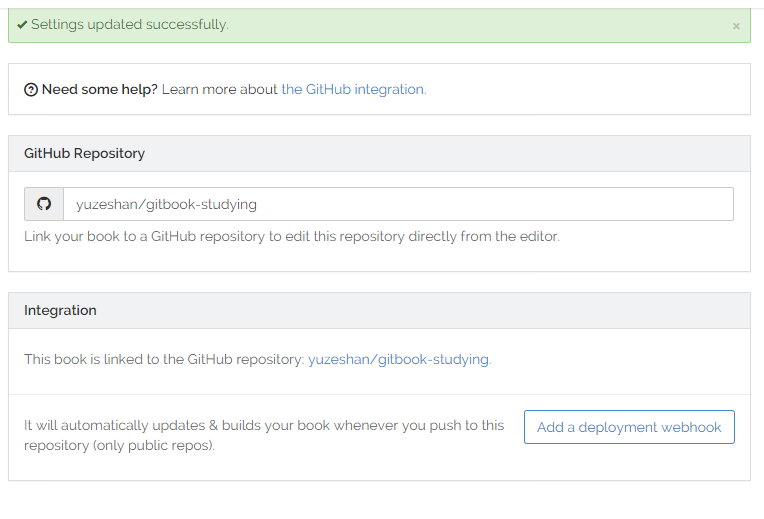

发布到github仓库
==
[GitBook.com](gitbook.com) 为每本书籍都创建了一个 Git 项目，并且使用这个 Git 项目来管理书籍源码（注意：这里的源码是指所有用户提交的内容）。正如在 *编辑书籍* 中介绍的那样，我们可以通过向书籍的 Git 项目提交内容来更新书籍。

另外，GitBook.com 还可以集成 GitHub，所以用户可以将书籍的源码通过 GitHub 上的项目来管理(而且在github上编辑时也可以同步到GitBook.com上对应的仓库)，这样可以使用 GitHub 带来的各种优点，例如：

- 其它用户可以 fork
- 用户可以点赞，获得更新提醒
- 用户可以贡献自己的内容

等等

这里，接着之前的实例，将使用 GitHub 中的项目来替代 GitBook.com 上的项目:https://git.gitbook.com/yuzeshan/gitbook-studying.git.分为以下三大步骤:

##在Github上创建仓库，并设置
- 登录Github账户，创建仓库`gitbook-studying`;
- 显示如下:

##在Gitbook.com上为该项目设置Github集成
 
首先，到Gitbook.com页面，将书籍的 Git 项目设置为 GitHub 上的项目，进入书籍属性页面，找到 "GitHub" 图标，如下图：

输入将要使用的 GitHub 上的项目，注意是公开的项目，如下图：

保存后，可以看到之前不可点击的 "Add a deployment webhook" 按钮已经可以点击了，这个按钮表示：每当用户配置的 GitHub 上的项目更新时，自动更新Gitbook.com书籍！

##将本地书籍导入Github上对应仓库

现在，将书籍原来的 Git 项目内容导入到新建的 GitHub 中的项目中，步骤如下:

1. 首先进入书籍目录(`E:\gitbook\gitbook-studying`)，之前如果已经在该目录下运行过git init后，就不许再次运行;
2. 将已经编辑好的书籍文件，用git add/commit命令依次添加，提交后;
3. 接下来将书籍仓库与远程github连接到一起，运行命令:`git remote add github https://git.gitbook.com/yuzeshan/gitbook-studying.git`(注意:并不是git remote add origin git@github.com:yuzeshan/gitbook-studying.git)；
4. 最后，将书籍仓库push到github仓库上，运行命令：`git push -u github master`;
5. git push 命令中的 -u 表示将本地 master 分支的上游分支设置为 github/master，所以以后修改了本地 master 分支后，git push 将推送到 github 上，而非原来的 `git remote add gitbook https://git.gitbook.com/yuzeshan/gitbook-studying.git`。

经过以上步骤后，就可以在本地修改文件，直接add，commit，然后push上github仓库上即可，修改github仓库的同时，gitbook.com上对应的书籍也会同步更新.

